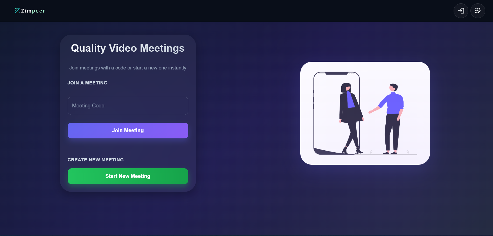
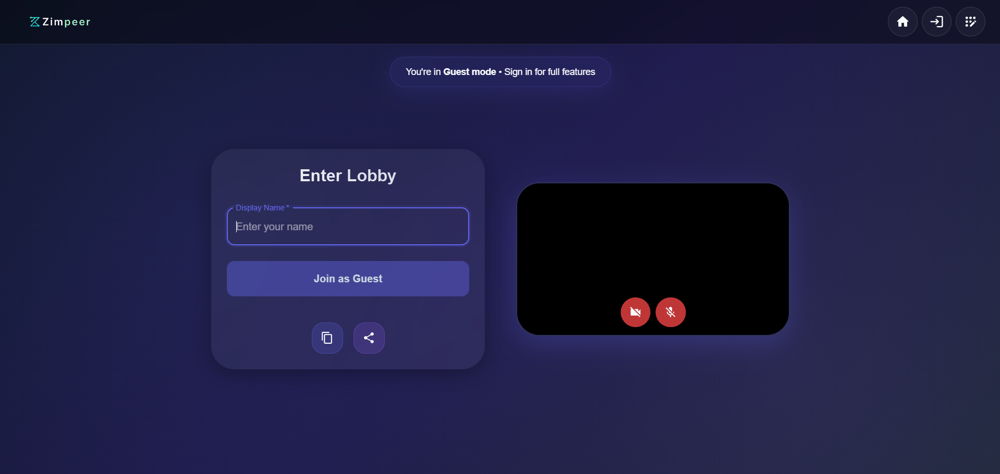

# Zimpeer

A browser-based video meeting app built with WebRTC.  
Create or join meetings instantly with a clean, modern UI.

## Live Demo
🔗 https://zimpeer.vercel.app

## Features

- 🎥 Real-time video & audio calls
- 🔗 Create & join meetings with code/link
- 👤 Guest join support
- 💬 In-meeting chat
- 🎙️ Mute / Unmute microphone
- 📷 Camera on / off
- 🖥️ Screen sharing
- 👥 Participant management
- 🔒 Secure authentication
- 📱 Responsive UI (mobile friendly)

## Tech Stack

### Frontend
- React
- Material UI
- Zustland
- Socket.io Client

### Backend
- Node.js
- Express.js
- Socket.io
- JWT Authentication

### Database
- MongoDB

### Real-time Communication
- WebRTC

## Screenshots


(./screenshots/meeting.png)

## How It Works

1. User logs in or joins as guest
2. Create a meeting or enter meeting code
3. Share code/link with others
4. Connect via WebRTC peer-to-peer communication
5. Chat, screen share, and collaborate

<!-- ## Installation

```bash
git clone https://github.com/devrittik/zimpeer.git
cd zimpeer
npm install -->

## Future Improvements

- SFU architecture for large meetings
- Recording support
- Background blur
- Raise hand reactions
- Meeting scheduling

## Author

Made by Rittik Chakraborty
LinkedIn: https://www.linkedin.com/in/rittik-chakraborty/
GitHub: https://github.com/devrittik/